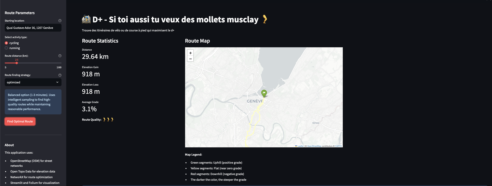

# 🚵‍♂️ D+ Route Finder: For Those Who Love Climbing

**Because flat routes are boring, and your calves deserve better!**

D+ Route Finder is a Streamlit web application that generates cycling and running routes optimized for maximum elevation gain. Say goodbye to boring flat routes and hello to leg-burning climbs that'll have you questioning your life choices (in the best way possible).



## 🌄 Features

- **Route Optimizer**: Create custom routes that maximize climbing while starting and ending at the same point
- **Steep Climb Finder**: Discover the most challenging climbs within your area for targeted training
- **Activity-specific routing**: Toggle between cycling and running modes (because cyclists and runners have different definitions of "fun")
- **Distance customization**: Configure route length from 3km (for runners) to 100km+ (for the masochistic cyclists)
- **Visual grade analysis**: Interactive maps with color-coded segments so you can see exactly where you'll be suffering
- **Export options**: Download routes and climbs in GPX, CSV, or GeoJSON formats for use with your favorite devices and apps

## 🏋️‍♀️ Why Elevation Training?

Training on routes with significant elevation:
- Builds leg strength and power
- Improves cardiovascular fitness
- Increases endurance
- Prepares you for varied race terrain
- Burns more calories
- Makes flat routes feel ridiculously easy afterward

## 🧠 Under the Hood

D+ Route Finder uses sophisticated algorithms to analyze the topography of your selected area:

1. **Route Optimizer**: Generates loop routes that intelligently seek out uphill segments while maintaining your desired distance
2. **Steep Climb Finder**: Identifies connected road segments with meaningful grades (because a 2-meter 20% section isn't useful, but a 500-meter 8% climb is gold)
3. **Elevation Integration**: Uses high-precision elevation data from EU-DEM and other sources via Open Topo Data API

## 👩‍💻 Technical Details

- **Simple Architecture**: Single Streamlit application file for straightforward maintenance
- **Graph Analysis**: NetworkX and OSMnx for network topology handling
- **Elevation Data**: Integration with Open Topo Data API (with local server option)
- **Visualization**: Interactive Folium maps with grade-based coloring
- **Algorithm Strategies**: Multiple route-finding approaches (greedy, optimized, thorough)
- **Docker Support**: Containerized setup for easy deployment

## 🚀 Getting Started

### Quick Start

### Option 1: Using Conda Environment

```bash
# Create and activate conda environment
conda env create -f environment.yml
conda activate d+

# Run the application
streamlit run app.py  # or streamlit run elevation_route_finder.py
```

### Option 2: Using Docker Compose

```bash
# Start the app with Docker Compose
docker-compose up -d

# Open http://localhost:8501 in your browser
```

### Option 3: Using pip with venv

```bash
# Create and activate virtual environment
python -m venv .venv
source .venv/bin/activate  # On Windows: .venv\Scripts\activate

# Install dependencies
pip install -r requirements.txt

# Run the application
streamlit run app.py  # or streamlit run elevation_route_finder.py
```

## 🧪 Usage Examples

### Finding an Elevation-Optimized Route

1. Select the "Route Finder" tab
2. Enter your location (e.g., "Alpe d'Huez, France")
3. Choose your activity type (cycling or running)
4. Set your desired distance
5. Click "Find Optimal Route"
6. Marvel at the punishment you're about to inflict on yourself

### Discovering Steep Climb Segments

1. Select the "Steep Climb Finder" tab
2. Enter a location known for climbs
3. Adjust the search radius and parameters
4. Click "Find Steep Climbs"
5. Review the ranked climbs and their profiles
6. Export your favorites to your device

## 📊 Elevation Data Sources

The application uses elevation data from:
- EU-DEM 25m (Europe)
- SRTM 30m (Global)
- Local datasets where available

For best results, consider setting up a local Open Topo Data server with detailed regional DEM data.

## 📁 Project Structure

The project follows a simple structure:

```
elevation-route-finder/
├── elevation_route_finder.py  # Main application file
├── requirements.txt           # Python dependencies
├── environment.yml            # Conda environment specification
├── Dockerfile                 # Docker configuration
├── docker-compose.yml         # Docker Compose setup
└── README.md                  # This documentation
```

## 🚧 Limitations

- Elevation data accuracy depends on the source dataset
- Network quality varies by region (OpenStreetMap coverage)
- Urban areas may have limited climb options (blame geography, not the app)
- API rate limits apply when using the public Open Topo Data service

## 📜 License

MIT

## 👐 Contributing

Contributions welcome! See [CONTRIBUTING.md](CONTRIBUTING.md) for guidelines.

Remember:
> "The road to fitness is always uphill"
>
> — Cyclists and runners everywhere